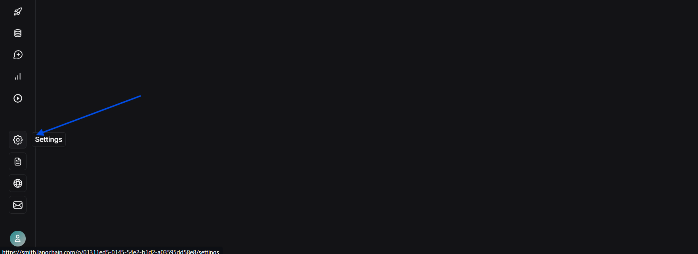
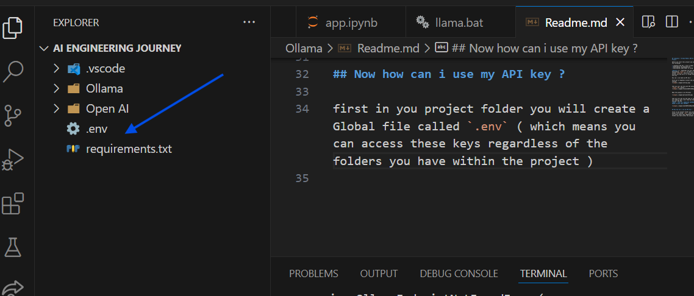
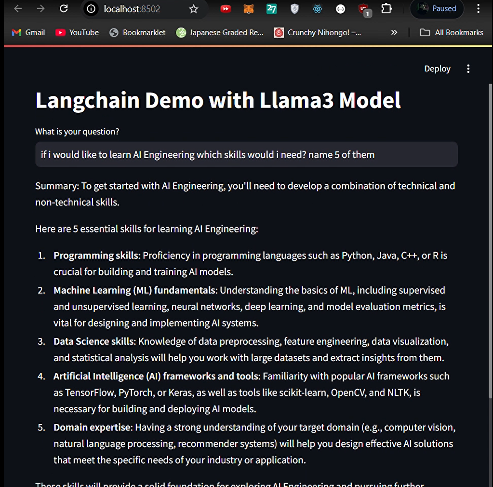

## Langchain + Ollama Models GEN AI LLM Project 

before you start this project you will need the following : 

* Langchain API Key ( free to make) 
* Downloading the dependencies 
* Downloading LLAMA model im using `llama 3.2`
* streamlit tool  

**Notes** 📝 : Sometimes you will have to keep downloading `llama 3.2` so there is a file called `llama.bat` which will loop this process you may use it if things dont work with you

How can i can make my API key ? 

First go to langchain account and press on setting 



Then you will see the word API press on `Create  API` button : 


Make the purpose to be Personal 


then you will get you key Copy it cause you will need it and i will show you how you can use your API Key 
**NOTE ⚠️ API IS A SENSITIVE INFORMATION DONT SHARE IT WITH JUST ANYONE** 


## Now how can i use my API key ? 

first in you project folder you will create a Global file called `.env` ( which means you can access these keys regardless of the folders you have within the project )


it should look like this  ( i have OPEN AI here cause i have a project that needs it )
**OPEN AI API'S ARE PAID 5$ MINIMUM TO CONNECT**


to ease downloading the dependencies that you would need add a text file with required dependencies and write 
```
`pip intall textfilename.txt` 
```
i will put the file in the github as well 


if the Ollama model doesnt wok that means in needs pulling use this command 

``` 
ollama pull llama3.2
```
note that this will take time 


now to run the app use this command 
```
streamlit run app.py
```

Output : 


